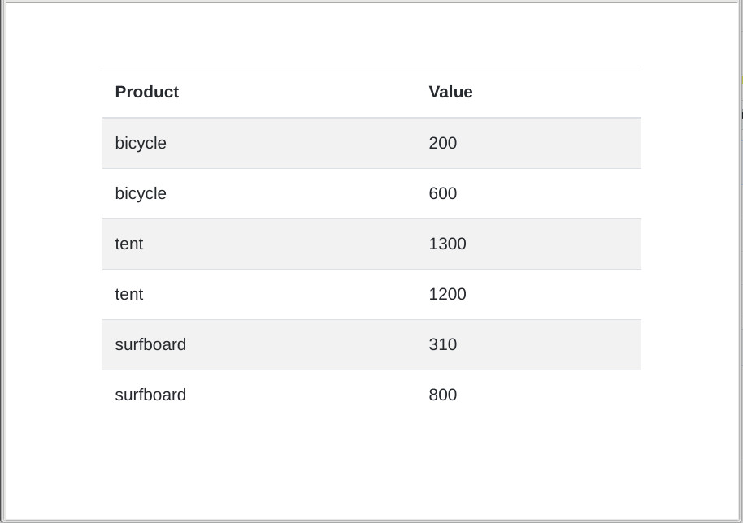
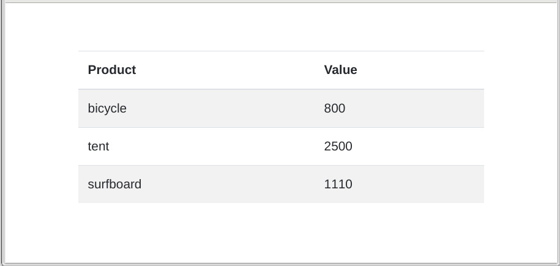

# javascript-groupby
Simple groupBy method using find(), filter() and reduce(). Language: JavaScript.

## From this

[[https://github.com/carloswimmer/javascript-groupby/docs/2018-08-26 15-52-01.jpg|alt=complete table]]

## To this

